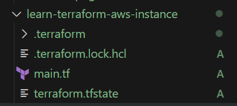

# Construindo Infraestrutura com Terraform

Este repositório trata da instalação e utilização do Terraform para provisionar infraestrutura como código (IAC), através da configuração de máquinas EC2 na AWS de forma automática.

<hr>

## Passo a Passo

### 1. Instalação do Terraform

Para windows, acesse o seguinte [link](https://developer.hashicorp.com/terraform/install?product_intent=terraform) e instale a versão Windows AMD64. 

Extraia para a pasta desejada e adicione o caminho da pasta ao ``Path``, nas variáveis de ambiente.


Para testar a instalação, execute o comando no terminal:

```cmd
terraform  -v
```

A saída deve se parecer com:

```cmd
C:\>terraform  -v
Terraform v1.10.2
on windows_amd64
```

<hr>

### 2. Instalação do CLI da AWS

Para Windows, acesse o [link](https://docs.aws.amazon.com/cli/latest/userguide/getting-started-install.html) e faça o download da versão 64-bit Windows.

Prossiga a instalação através do Wizard.
Para verificar a instalação, execute o comando no terminal:

```cmd
aws --version
```

A saída deve se parecer com:

```
C:\>aws --version
aws-cli/2.22.18 Python/3.12.6 Windows/10 exe/AMD64
```

Caso necessário, adicione o caminho da pasta de instalação do AWS CLI ao Path. O caminho padrão deve ser parecido com `C:\Program Files\Amazon\AWSCLIV2`.

<hr>

### 3. Configurando as Credenciais

Acesse o laboratório da AWS e copie as credenciais:


Através do comando abaixo, insira as credenciais:
```cmd
C:\>aws configure
AWS Access Key ID []: credencial
AWS Secret Access Key []: credencial
```

**Opcional**

Pode ser necessário configurar o ``aws_session_token``. Para isso, no windows acesse o arquivo `C:\Users\user\.aws\credentials`, e com um bloco de notas,adicione a nova credencial.

<hr>

### 4. Iniciando o Terraform

Na pasta [learn-terraform-aws-instance](./learn-terraform-aws-instance/) há um arquivo de configuração padrão. Dentro da pasta, execute o comando para iniciar os módulos do terraform:

```cmd
terraform init
```

Para validação, é possivel utilizar:

```cmd
terraform fmt
```

```cmd
terraform validate
```

A estrutura deve ser a seguinte:



Para aplicar as alterações à AWS, execute:

```cmd
terraform apply
```

### 5. Finalização

Caso tudo ocorra como o esperado, a seguinte mensagem será exibida, e a instância EC2 foi criada:


A instância em execução:

